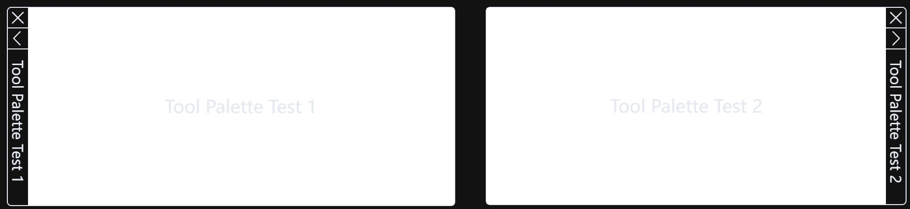
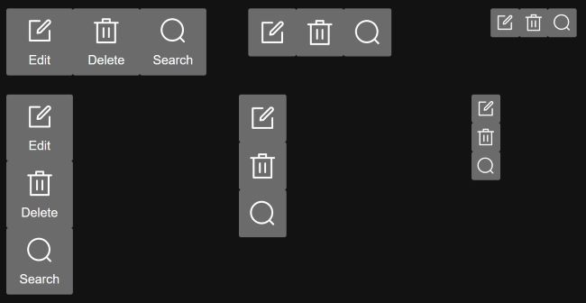

# Common UI Component Libaray

This is one common UI component library based on Element Plus. 

## Components

The following components are included in this package.

- Tool Palette: one dockable, resizable, and floating window, which is quite similar to AutoCAD Tool Palette.
- Toolbar: one toolbar which can be easily customized by one array of button data. 

### Tool Palette

AutoCAD uses [tool palettes](https://help.autodesk.com/view/ACD/2025/ENU/?guid=GUID-167A8594-92CB-4FCC-B72C-0F546383E97C) to organize blocks, hatches, and custom tools in a tabbed window. Tool Palette component is quite similar to one in AutoCAD. It supports the following features.

- Dockable: dock to the left or right side of the window
- Folderable: roll open or closed as your need
- Auto-hide: roll open and closed as the cursor moves across it. When this option is cleared, the full tool palette stays open continuously.



You can customize tool palette by the following properties. 

```javascript
/**
 * Properties of MlToolPalette component
 */
interface Props {
  /**
   * The title of tool palette dialog
   */
  title?: string
  /**
   * The minimum distance from the left side of the tool palette to the left side of the window
   */
  leftOffset?: number
  /**
   * The minimum distance from the right side of the tool palette to the right side of the window
   */
  rightOffset?: number
  /**
   * The minimum distance from the top side of the tool palette to the top side of the window
   */
  topOffset?: number
  /**
   * The minimum distance from the bottom side of the tool palette to the bottom side of the window
   */
  bottomOffset?: number
}
```

Four `offsetXXX` properties are used to set the minimum distance from the side of the tool palette to the side of the window. It is quite useful if you want the tool palette is shown within certain area. For example, one web page has one title bar at the top of window, one status bar at the bottom of window, and one canvas area between the title bar and the status bar. The height of the title bar is 60px and the height of the status bar is 20px. Then you can set `topOffset` to 60 and `bottomOffset` to 20 to let the tool palette are shown and moved within canvas area only. 

```javascript
<script lang="ts" setup>
import { MlToolPalette } from '@mlightcad/ui-components'
const toolPaletteVisible = ref<boolean>(false)
</script>

<template>
  <ml-tool-palette
    class="tool-palette"
    v-model="toolPaletteVisible"
    title="Tool Palette Test"
    :top-offset="60"
    :bottom-offset="20"
  >
    <span>Tool Palette Test</span>
  </ml-tool-palette>
</template>

<style scoped>
.tool-palette {
  position: fixed;
  top: 55px;
  width: 400px;
}
</style>
```

### Toolbar

Toolbar component has the followiing features.

- Define button list by one array of `MlButtonData`
- Arrange button vertically or horizontally
- Support three kind of button size



Features above can be customized by the following properties.

```javascript
/**
 * Properties of MLToolbar components
 */
interface Props {
  /**
   * An array of button data
   */
  items: MlButtonData[]
  /**
   * Button size.
   * - small: 30px
   * - medium: 50px
   * - large: 70px
   */
  size?: 'small' | 'medium'| 'large'
  /**
   * Layout type.
   * - vertical: arrange button vertically
   * - horizontal: arrange button horizontally
   */
  direction?: 'vertical' | 'horizontal'
}
```

Buttons in toolbar are described by the following data. Property `icon` can be icon provided by Element Plus or icon imported through `vite-svg-loader`.

```javascript
/**
 * Data to descibe button appearance
 */
export interface MlButtonData {
  /**
   * Icon represented by one vue component
   */
  icon: Component 
  /**
   * Text shown below icon
   */
  text: string
  /**
   * Command string which will be passed to click event as event arguments
   */
  command: string
  /**
   * Tooltips content when hover
   */
  description?: string
}
```

Usage of this component is as follows. 

```javascript
<script setup lang="ts">
import '@mlightcad/ui-components/dist/style.css'
import { MlButtonData, MlToolbar } from '@mlightcad/ui-components'
import { reactive } from 'vue'
import { Delete, Edit, Search } from '@element-plus/icons-vue'

const data = reactive<MlButtonData[]>([
  {
    icon: Edit,
    text: 'Edit',
    command: 'edit',
    description: 'This is description for edit button'
  },
  {
    icon: Delete,
    text: 'Delete',
    command: 'delete',
    description: 'This is description for delete button'
  },
  {
    icon: Search,
    text: 'Search',
    command: 'search',
    description: 'This is description for search button'
  }
])

const handleCommand = (command: string) => {
  console.log(command)
}
</script>

<template>
  <div>
    <ml-toolbar :items="data" layout="vertical" @click="handleCommand"/>
  </div>
</template>

<style></style>
```